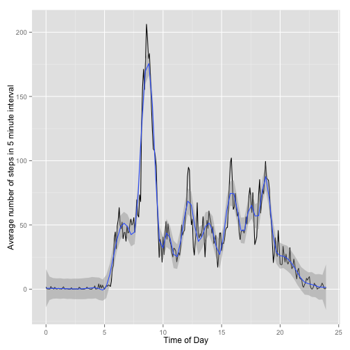
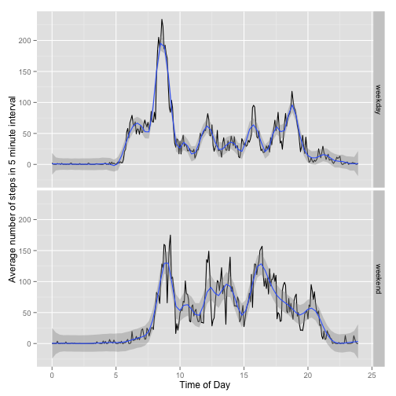

# Reproducible Research: Peer Assessment 1

### preliminaries, partly dependent on local settings
We would normally set ```echo=FALSE``` for this chunk, but show it here to illustrate why the ```unzip``` and ```read.csv``` commands in the next chunk work without full paths.

```r
opts_knit$set(echo=TRUE)
setwd("~/Documents/teaching/coursera/Reproducible Research/projects/RepData_PeerAssessment1")
```

## Loading and preprocessing the data
First, data are unzipped and loaded using ```read.csv```. Date and time variables like month, weekday etc. were computed by casting the date variable to class Date and further to class POSIXlt using ```as.Date``` and ```as.POSIXlt```, then extracting the relevant fields from the latter.
Similarly, to answer a question below about the average daily activity pattern, it was advisable to transform the ```interval``` variable to a decimal representation. According to the description, the "device collects data at 5 minute intervals through out the day." The numerical variable apparently codes hour of the day in the first of three digits (0 o'clock if absent) and minutes of the hour in the second and third digit. This means that there are "jumps" between minute 55 and the full hour. Thus data were transformed to a decimal representation starting at 0 hours, with minutes transformed to decimal fractions (```timeOfDay100```). Note that a better approach might have been to use one of the time classes.


```r
unzip("activity.zip")
actmon <- read.csv("activity.csv")
str(actmon)
```

```
## 'data.frame':	17568 obs. of  3 variables:
##  $ steps   : int  NA NA NA NA NA NA NA NA NA NA ...
##  $ date    : Factor w/ 61 levels "2012-10-01","2012-10-02",..: 1 1 1 1 1 1 1 1 1 1 ...
##  $ interval: int  0 5 10 15 20 25 30 35 40 45 ...
```

```r
# compute a few date-related variables
actmon$ddate <- as.Date(actmon$date)
actmon$wday <- as.POSIXlt(actmon$ddate)[["wday"]]
actmon$mday <- as.POSIXlt(actmon$ddate)[["mday"]]
actmon$yday <- as.POSIXlt(actmon$ddate)[["yday"]]
actmon$mon <- as.POSIXlt(actmon$ddate)[["mon"]]
actmon$year <- as.POSIXlt(actmon$ddate)[["year"]]
# compute time variables on a decimal scale
head(actmon$interval, 30)
```

```
##  [1]   0   5  10  15  20  25  30  35  40  45  50  55 100 105 110 115 120
## [18] 125 130 135 140 145 150 155 200 205 210 215 220 225
```

```r
table(diff(actmon$interval))
```

```
## 
## -2355     5    45 
##    60 16104  1403
```

```r
actmon$minute <- actmon$interval %% 100
actmon$hour <- (actmon$interval - actmon$minute)/100
actmon$timeOfDay100 <- actmon$hour + actmon$minute/60
```

## What is mean total number of steps taken per day?
According to the instructions, the missing values in the dataset can be ignored for this task. A histogram of steps per day shows a fairly symmetric distribution around roughly 10.000. Surprisingly, there were 2 days with hardly any steps.

```r
actmonFull <- actmon[complete.cases(actmon),]
stepsPerDay <- with(actmonFull, tapply(steps, date, sum, na.rm=TRUE))
hist(stepsPerDay, 30)
```

 

```r
summary(stepsPerDay, digits=7)
```

```
##    Min. 1st Qu.  Median    Mean 3rd Qu.    Max.    NA's 
##      41    8841   10765   10766   13294   21194       8
```

The mean total number of steps taken per day is 10766. The median total number of steps taken per day is 10765

The above refers to uncleaned data. Note that some values for the number of steps per five-minute interval appear somewhat implausible, suggesting that the classification algorithm used in the recording device might have failed in certain cases. The maximum number of steps per 5-minute interval was ``806``, corresponding to ``2.6867`` steps per second. However, since these high values were not isolated outliers, and might also conceivably have resulted from some physical exercise like aerobics or cycling (as also indicated by the bimodal shape of the distribution of log steps), I decided to keep them in the analyses.


```r
par(mfrow=c(1,2))
hist(actmonFull$steps, 100)
hist(log(actmonFull$steps), 100)
```

 

```r
max(actmonFull$steps)/5/60
```

```
## [1] 2.687
```

## What is the average daily activity pattern?
The following plot shows the average across all days of the number steps for each five-minute interval. The solid black line connects the individual means, and the blue line is an adaptive gam smoother.

```r
qplot(data=actmonFull, x=timeOfDay100, y=steps, stat="summary", fun.y=mean, xlab="Time of Day", ylab="Average number of steps in 5 minute interval", geom="line") + stat_smooth(method="gam", formula = y ~ s(x, bs = "ad")) 
```

```
## Loading required package: splines
```

 

The following plot shows the same summary, using the base plot system, to conform with the requirement to use ```type=="l"``` in the time series plot.


```r
actPerInterval <- with(actmonFull, tapply(steps, timeOfDay100, mean))
plot(names(actPerInterval), actPerInterval, type="l", xlab="Time of Day", ylab="Average number of steps in 5 minute interval") 
```

 

```r
names(which.max(actPerInterval))
```

```
## [1] "8.58333333333333"
```

```r
numMax <- as.numeric(names(which.max(actPerInterval)))
(minutes <- numMax %% 1 * 60)
```

```
## [1] 35
```

```r
(hours <- floor(numMax))
```

```
## [1] 8
```

Between about 10 pm (22:00) and 5:30 am there was a fairly well-synchronized resting period; in other words, the person seems to have a relatively constant sleep-wake-cycle. The person was on average most active during between 8 and 9 in the morning. A maximal average of ``206.1698`` steps was reached at ``8``:``35``. There is also walking activity between 10 am and 7 pm  (19:00), but appears to be not as well-synchronized as the morning peak activity. Alternatively, it might just indicate less overall walking activity in theses hours.

## Imputing missing values
There are a number of days/intervals where there are missing values. The presence of missing days may introduce bias into some calculations or summaries of the data.


```r
(Nmissing <- nrow(actmon) - sum(complete.cases(actmon)))
```

```
## [1] 2304
```
The total number of rows with missing values was ``2304``.

The pattern of steps over intervals of the day, averaged across days (see above) was more informative than the pattern over other variables like day of month, month, or year. The varaible coding the day of week did seem to influence the number of steps walked, with more activity on the weekends and on Wednesdays than during the rest of the week. However, the combination of using time of day and day of week was too noisy. Therefore, and for the sake of simplicity, missing values were filled in by using the mean across days for a 5-minute interval. The mean rather than the median (of values larger than zero) was chosen because it appeared less noisy.

A new dataset was created that is equal to the original dataset but with the missing data filled in.


```r
ix <- match(actmon$timeOfDay100, as.numeric(names(actPerInterval)))
stepsFilled <- actPerInterval[ix]
stepsFilled[!is.na(actmon$steps)] <- actmon$steps[!is.na(actmon$steps)]
actmonFilled <- data.frame(actmon, stepsFilled)
```

A comparison of histograms and summaries of the total number of steps taken each day with original vs. filled-in data shows that neither mean nor median differ, whereas the standard deviation is smaller in the imputed data set. Furthermore, if only days with at least one step are analyzed, the mean and median of the imputed data set are smaller than of the original data set. Finally, the impact of imputing missing data on the estimates of the total daily number of steps is to shift the mean and median of the distribution to the left by creating 8 days with 3642.34 steps which apparently previously had only missing values.


```r
par(mfrow=c(2,2))
hist(actmon$steps, 50)
hist(log(actmon$steps), 50)
hist(actmonFilled$stepsFilled, 50)
hist(log(actmonFilled$stepsFilled), 50)
```

 

```r
summary(actmon$steps)
```

```
##    Min. 1st Qu.  Median    Mean 3rd Qu.    Max.    NA's 
##     0.0     0.0     0.0    37.4    12.0   806.0    2304
```

```r
summary(actmonFilled$stepsFilled)
```

```
##    Min. 1st Qu.  Median    Mean 3rd Qu.    Max.    NA's 
##     0.0     0.0     0.0    37.4    18.0   806.0    1536
```

```r
summary(actmon$steps[actmonFilled$stepsFilled>0])
```

```
##    Min. 1st Qu.  Median    Mean 3rd Qu.    Max.    NA's 
##       1      25      56     134     147     806    2240
```

```r
summary(actmonFilled$stepsFilled[actmonFilled$stepsFilled>0])
```

```
##    Min. 1st Qu.  Median    Mean 3rd Qu.    Max.    NA's 
##     0.1    23.0    51.5   121.0   121.0   806.0    1536
```

```r
sd(actmon$steps, na.rm=TRUE)
```

```
## [1] 112
```

```r
sd(actmonFilled$stepsFilled, na.rm=TRUE)
```

```
## [1] 109.6
```

```r
stepsPerDayFilled <- with(actmonFilled, tapply(stepsFilled, date, sum, na.rm=TRUE))
summary(stepsPerDay)
```

```
##    Min. 1st Qu.  Median    Mean 3rd Qu.    Max.    NA's 
##      41    8840   10800   10800   13300   21200       8
```

```r
summary(stepsPerDayFilled)
```

```
##    Min. 1st Qu.  Median    Mean 3rd Qu.    Max. 
##      41    6780   10400    9830   12800   21200
```

```r
par(mfrow=c(2,1))
hist(stepsPerDay, 30)
hist(stepsPerDayFilled, 30)
```

 

```r
which.max(table(stepsPerDayFilled))
```

```
## 3642.33962264151 
##                5
```


## Are there differences in activity patterns between weekdays and weekends?
The following plot shows that there are differences in the activity patterns between weekdays and weekends. The morning activity peak during weekdays is more pronounced, suggesting a fairly orderly life, and preceded by a smaller peak, suggesting that sometimes the person rises an hour earlier. During the weekends, the persons still has a morning activity peak, but this is a little bit later and more washed out. On weekends, there is another peak in the afternoon, possibly suggesting a stroll or run. Activity also continues a bit later into the night on the weekends.

```r
actmon$weekday <- weekdays(actmon$ddate)
actmon$weekend <- factor(ifelse(actmon$weekday %in% c("Saturday", "Sunday"), "weekend", "weekday"))
qplot(data=actmon, x=timeOfDay100, y=steps, stat="summary", fun.y=mean, xlab="Time of Day", ylab="Average number of steps in 5 minute interval", geom="line") + stat_smooth(method="gam", formula = y ~ s(x, bs = "ad")) + facet_grid(weekend ~ .)
```

```
## Warning: Removed 1728 rows containing missing values (stat_summary).
## Warning: Removed 576 rows containing missing values (stat_summary).
## Warning: Removed 1728 rows containing missing values (stat_smooth).
## Warning: Removed 576 rows containing missing values (stat_smooth).
```

 


